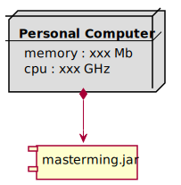

<!DOCTYPE html>
<html lang="en">
<head>
<meta charset="UTF-8">
<meta http-equiv="X-UA-Compatible" content="IE=edge">
<meta name="viewport" content="width=device-width, initial-scale=1.0">
<meta name="generator" content="Asciidoctor 2.0.8">
<meta name="author" content="Santa Tecla">
<link rel="stylesheet" href="https://fonts.googleapis.com/css?family=Open+Sans:300,300italic,400,400italic,600,600italic%7CNoto+Serif:400,400italic,700,700italic%7CDroid+Sans+Mono:400,700">
<link rel="stylesheet" href="https://cdnjs.cloudflare.com/ajax/libs/font-awesome/4.7.0/css/font-awesome.min.css">
</head>
<body class="book">

<h1>Mastermind. Solución 17.1. <strong>mvp.sc</strong></h1>

Santa Tecla 
<a href="mailto:parqueNaturalSantaTecla@gmail.com">parqueNaturalSantaTecla@gmail.com</a> 
version 0.0.1

Índice

<ul class="sectlevel1">
<li><a href="#requisitos-1-básica">Requisitos 1. <strong>Básica</strong></a></li>
<li><a href="#vista-de-lógicadiseño">Vista de Lógica/Diseño</a>
<ul class="sectlevel2">
<li><a href="#arquitectura">Arquitectura</a></li>
<li><a href="#paquete-mastermind">Paquete <em>mastermind</em></a></li>
<li><a href="#paquete-mastermind-controllers">Paquete <em>mastermind.controllers</em></a></li>
<li><a href="#paquete-mastermind-views">Paquete <em>mastermind.views</em></a></li>
<li><a href="#paquete-mastermind-models">Paquete <em>mastermind.models</em></a></li>
<li><a href="#paquete-mastermind-types">Paquete <em>mastermind.types</em></a></li>
<li><a href="#paquete-santatecla-utils">Paquete <em>santaTecla.utils</em></a></li>
</ul>
</li>
<li><a href="#vista-de-desarrolloimplementación">Vista de Desarrollo/Implementación</a></li>
<li><a href="#vista-de-desplieguefísica">Vista de Despliegue/Física</a></li>
<li><a href="#vista-de-procesos">Vista de Procesos</a></li>
</ul>

<h2 id="requisitos-1-básica">Requisitos 1. <strong>Básica</strong></h2>

<table class="tableblock frame-all grid-all stretch">
<colgroup>
<col style="width: 50%;">
<col style="width: 50%;">
</colgroup>
<tbody>
<tr>
<td class="tableblock halign-left valign-top">

<ul>
<li>

<a href="https://en.wikipedia.org/wiki/Mastermind_(board_game)"><strong>Wiki</strong></a> - <a href="https://www.youtube.com/watch?v=2-hTeg2M6GQ"><strong>Youtube</strong></a>

<ul>
<li>

<em>Funcionalidad: <strong>Básica</strong></em>

</li>
<li>

<em>Interfaz: <strong>Texto</strong></em>

</li>
<li>

<em>Distribución: <strong>Standalone</strong></em>

</li>
<li>

<em>Persistencia: <strong>No</strong></em>

</li>
</ul>

</li>
</ul>

</td>
<td class="tableblock halign-left valign-top">

</td>
</tr>
</tbody>
</table>

<h2 id="vista-de-lógicadiseño">Vista de Lógica/Diseño</h2>

<h3 id="arquitectura">Arquitectura</h3>

<ul>
<li>

<em>Modelo/Vista/Presentador con</em> <strong class="lime-background">Controlador Supervisor_</strong>

</li>
</ul>

<h3 id="paquete-mastermind">Paquete <em>mastermind</em></h3>

<h3 id="paquete-mastermind-controllers">Paquete <em>mastermind.controllers</em></h3>

<h3 id="paquete-mastermind-views">Paquete <em>mastermind.views</em></h3>

<h3 id="paquete-mastermind-models">Paquete <em>mastermind.models</em></h3>

<h3 id="paquete-mastermind-types">Paquete <em>mastermind.types</em></h3>

<h3 id="paquete-santatecla-utils">Paquete <em>santaTecla.utils</em></h3>

<h2 id="vista-de-desarrolloimplementación">Vista de Desarrollo/Implementación</h2>

<h2 id="vista-de-desplieguefísica">Vista de Despliegue/Física</h2>

<h2 id="vista-de-procesos">Vista de Procesos</h2>

<ul>
<li>

No hay concurrencia

</li>
</ul>

Version 0.0.1 
Last updated 2019-10-21 09:42:28 +0200

</html>